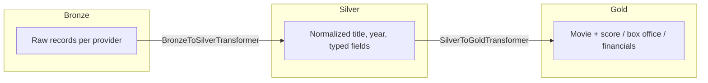

# Clarity AI interview

In this interview a Movie Score Data Pipeline has been implemented following Hexagonal architecture and Medallion Data Architecture. More on that can be found in the following links.

Hexagonal architecture: [https://www.happycoders.eu/software-craftsmanship/hexagonal-architecture/](https://www.happycoders.eu/software-craftsmanship/hexagonal-architecture/)
Medallion data architecture: [https://www.databricks.com/blog/what-is-medallion-architecture](https://www.databricks.com/blog/what-is-medallion-architecture)

## Medallion flow (conceptual)




## What it does

`src/main.py` runs three independent pipelines end to end:


| Pipeline               | Bronze source                                                                                 | Silver outputs                                          | Gold                                                                       |
| ---------------------- | --------------------------------------------------------------------------------------------- | ------------------------------------------------------- | -------------------------------------------------------------------------- |
| **Critic Agg**         | `data/provider1.csv`                                                                          | One score row per movie                                 | `GoldMovieData` + `GoldScore` per movie                                    |
| **Audience Pulse**     | `data/provider2.json`                                                                         | Separate silver lists for box office and audience score | Gold from **both** silver lists concatenated (`score + box_office`)        |
| **Box Office Metrics** | `data/provider3_domestic.csv`, `provider3_international.csv`, `data/provider3_financials.csv` | Box office (domestic + international) and financials    | Combined silver lists → `GoldMovieData`, `GoldBoxOffice`, `GoldFinancials` |


Silver entities carry `(movie_title, release_year)` as the natural key for a title, as well as Gold entities.

## Pipelines in `main.py`

```mermaid
flowchart TB
    subgraph critic[Critic Agg]
        CA_B[CriticAggMovieExtractor]
        CA_S[CriticAggBronzeToSilverTransformer per movie]
        CA_G[CriticAggSilverToGoldTransformer]
        CA_B --> CA_S --> CA_G
    end
    subgraph aud[Audience Pulse]
        AP_B[AudiencePulseMovieExtractor]
        AP_SBO[AudiencePulseBronzeToSilverBoxOfficeTransformer]
        AP_SS[AudiencePulseBronzeToSilverScoreTransformer]
        AP_G[AudiencePulseSilverToGoldTransformer concat lists]
        AP_B --> AP_SBO
        AP_B --> AP_SS
        AP_SS --> AP_G
        AP_SBO --> AP_G
    end
    subgraph box[Box Office Metrics]
        BO_B1[BoxOfficeMetricsMovieExtractor]
        BO_B2[BoxOfficeMetricsMovieFinancialsExtractor]
        BO_S1[BoxOfficeMetricsBronzeToSilverBoxOfficeTransformer]
        BO_S2[BoxOfficeMetricsBronzeToSilverFinancialsTransformer]
        BO_G[BoxOfficeMetricsSilverToGoldTransformer concat lists]
        BO_B1 --> BO_S1
        BO_B2 --> BO_S2
        BO_S1 --> BO_G
        BO_S2 --> BO_G
    end
```




## Run the project

Both the main.py and the tets can be run locally or from Docker. 

### Locally

From the repository root, with `data/` present:

```bash
PYTHONPATH=src python3 src/main.py
```

Install dev tools and run tests (with [uv](https://github.com/astral-sh/uv)):

```bash
uv sync --group dev
uv run pytest tests -v
```

Or use `python -m pytest` from an environment where `pytest` is installed and `pythonpath` includes `src` (as in `[tool.pytest.ini_options]`).

### Docker

**Run the app** (mounts local `./data` into the container):

```bash
docker compose up --build
```

**Unit tests** (builds the `test` stage, `pytest` included):

```bash
docker compose --profile cli-only run --rm unit_tests
```

## Data

Place or keep sample files under `data/`:


| File                                                    | Used by           |
| ------------------------------------------------------- | ----------------- |
| `provider1.csv`                                         | Critic Agg        |
| `provider2.json`                                        | Audience Pulse    |
| `provider3_domestic.csv`, `provider3_international.csv` | Box office bronze |
| `provider3_financials.csv`                              | Financials bronze |


Extractors resolve paths relative to the project `data/` directory.

## Questions proposed

### How easily could your code be modified to add a Provider 4 with a new data format?

If we want to add a new provider we have to implement the bronze entity, create the extractor and the transformers (bronze to silver and silver to gold). I assume with my answer that there's no new datafield that would make us want to change our Silver/Gold entities.

### How would you handle a provider changing their schema?

We will have to modify the  bronze entity implementation, the extractor and the transformers (bronze to silver and silver to gold). I assume with my answer that there's no new datafield that would make us want to change our Silver/Gold entities. 

Also if providers change their schema and remove any field, the system will raise an exception. As it is right now in the [main.py](http://main.py), the execution will halt, but this exception could also be handled and continue ingesting the rest of the data.

### Extra: what happens if two providers' data differ?

Due to the implementation, if providers' data collide (i.e. different domestic financial data for the same movie) it won't cause any issue in the system: two records will be created stating clearly where that data comes from so there won't be any collision internally.

## Future steps

- Entities could be stored in a database
- The pipelines can be scheduled to be run when the new data is updated/uploaded (weekly, every 15 days, etc)
- More tests could be added - integration, end-to-end, data quality

